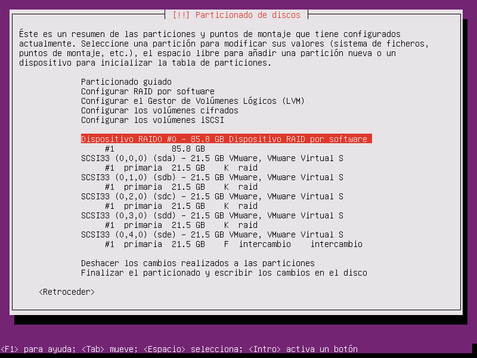
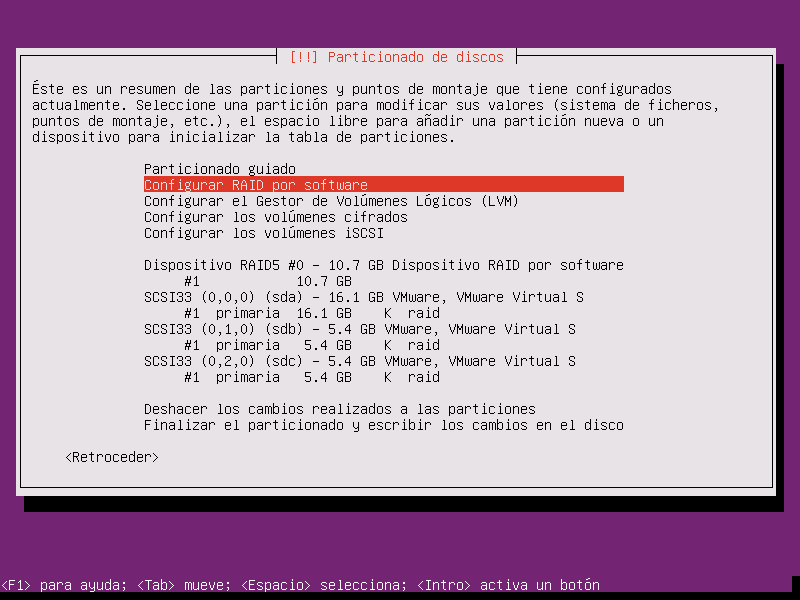

# Ejercicio-DNS

#named.conf.local

zone "sitioa.com" {
        type master;
    file "/etc/bind/rd.sitioa.com";
};
------------------------------------------------------------
zone "sitiob.net" {
        type master;
    file "/etc/bind/rd.sitiob.net";
};
------------------------------------------------------------
zone "sitioc.net" {
        type master;
    file "/etc/bind/rd.sitioc.net";
};

// Resolución inversa

zone "5.168.192.in-addr.arpa" {
    type master;
        file "/etc/bind/r1.192.168.5";
};

------------------------------------------------------------
options {
    directory "/var/cache/bind";

     forwarders {
            8.8.8.8;
        80.58.61.250;
     };
    dnssec-validation auto;

    auth-nxdomain no;    # conform to RFC1035
    listen-on-v6 { any; };
};
------------------------------------------------------------
#rd.sitioa.com

$TTL 38400

@   IN  SOA servidor2.sitioa.com. correoadmin.sitioa.com. (
            2014092901
            28800
            3600
            604800
            38400 )

@ IN NS servidor1.sitioa.com.
servidor1.sitioa.com. IN A 192.168.5.30
www.sitioa.com. IN CNAME servidor1.sitioa.com. 

#rd.sitiob.net

$TTL 38400

@   IN  SOA servidor2.sitiob.net. correoadmin.sitiob.net. (
            2014092902
            28800
            3600
            604800
            38400 )

@ IN NS servidor2.sitiob.net.
servidor2.sitiob.net. IN A 192.168.5.31
www.sitiob.net. IN CNAME servidor2.sitiob.net. 

#rd.sitioc.net

$TTL 38400

@   IN  SOA servidor3.sitioc.net. correoadmin.sitioc.net. (
            2014092903
            28800
            3600
            604800
            38400 )

@ IN NS servidor3.sitioc.net.
servidor3.sitioc.net. IN A 192.168.5.32
www.sitioc.net. IN CNAME servidor3.sitioc.net. 

---------------------------------------------------------------------
ri.192.168.5

$TTL 38400

@ IN SOA servidor1.sitioa.com. correoadmin.sitioa.com. (
    2014092900;  //num serie
    28800; //refresco
    3600;  //reintentos
    604800; //caducidad
        38400); // tiempo en caché

@ IN NS servidor1.
30 IN PTR servidor1.

@ IN NS servidor2.
31 IN PTR servidor2.

@ IN NS servidor3.
32 IN PTR servidor3.

-----------------------------------------------------------------------

Configuracion del router:  
  
Editamos sysctl.conf:  
nano /etc/sysctl.conf  
--------------------------
Descomentamos la linea:  
net.ipv4.ip_forward=1  
--------------------------
Creamos un archivo llamado router.sh  
nano router.sh
--------------------------
Le añadimos las 2 siguientes lineas:  
#!/bin/bash  
iptables -t nat -A POSTROUTING -o ens33 -j MASQUERADE  
--------------------------
editamos el archivo /etc/rc.local y le añadimos lo siguiente delante de Exit 0:  
sh /home/usuario/router.sh  
--------------------------

Raid 0:

Raid 5:

